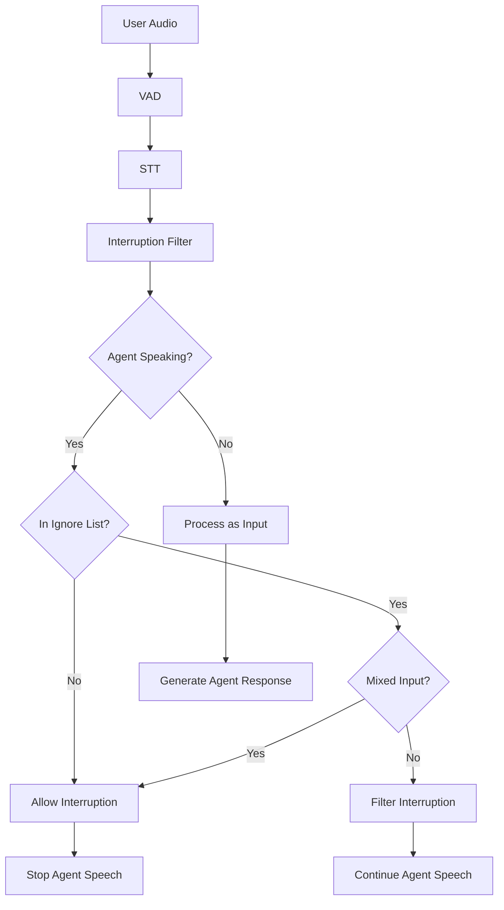

# Design Document: Intelligent Interruption Handling

## Overview

The Intelligent Interruption Handling system adds context-aware filtering to the LiveKit Agents framework's interruption mechanism. It distinguishes between passive acknowledgements (backchanneling like "yeah", "ok", "hmm") and active interruptions (commands like "stop", "wait") based on the agent's current speaking state.

The key insight is that the same user input should be treated differently depending on context:
- When the agent is **speaking**: backchanneling should be ignored to maintain speech flow
- When the agent is **silent**: backchanneling should be processed as valid user input

This design implements a filtering layer that sits between VAD/STT detection and the interruption handling logic, making intelligent decisions without modifying the underlying VAD kernel.

## Architecture

### High-Level Flow

```
User Speech → VAD Detection → STT Transcription → Interruption Filter → Interruption Decision
                                                           ↓
                                                    Agent State Check
                                                    Ignore List Match
                                                    Semantic Analysis
```

### Component Diagram



### Integration Points

1. **AgentSession**: Main integration point where the filter is initialized and configured
2. **AgentActivity**: Monitors agent speaking state to determine when filtering should apply
3. **VAD Events**: Receives voice activity detection events
4. **STT Stream**: Receives transcription updates for semantic analysis
5. **Audio Output**: Ensures seamless continuation when interruptions are filtered

## Components and Interfaces

### 1. InterruptionFilter

The core component that makes filtering decisions.

```python
class InterruptionFilter:
    """
    Filters interruptions based on agent state and user input content.
    
    Attributes:
        ignore_list: Set of words/phrases that should not interrupt when agent is speaking
        enabled: Whether filtering is active
        pending_interruptions: Buffer of interruptions awaiting transcription validation
    """
    
    def __init__(
        self,
        ignore_list: list[str] | None = None,
        custom_filter_fn: Callable[[str, AgentState], bool] | None = None,
        enabled: bool = True
    ):
        """
        Initialize the interruption filter.
        
        Args:
            ignore_list: Custom list of backchanneling words (uses default if None)
            custom_filter_fn: Optional custom filtering logic
            enabled: Whether to enable filtering
        """
        pass
    
    def should_filter_interruption(
        self,
        transcription: str,
        agent_state: AgentState,
        agent_speaking: bool
    ) -> FilterDecision:
        """
        Determine if an interruption should be filtered.
        
        Args:
            transcription: The user's transcribed speech
            agent_state: Current agent state
            agent_speaking: Whether agent is currently speaking
            
        Returns:
            FilterDecision with action (ALLOW, FILTER, PENDING) and reason
        """
        pass
    
    def is_ignore_list_only(self, transcription: str) -> bool:
        """
        Check if transcription contains only words from the ignore list.
        
        Args:
            transcription: The transcribed text to analyze
            
        Returns:
            True if all words are in ignore list, False otherwise
        """
        pass
    
    def has_command_words(self, transcription: str) -> bool:
        """
        Check if transcription contains any non-ignored words.
        
        Args:
            transcription: The transcribed text to analyze
            
        Returns:
            True if any word is not in ignore list, False otherwise
        """
        pass
```

### 2. FilterDecision

Data class representing a filtering decision.

```python
@dataclass
class FilterDecision:
    """
    Represents the result of an interruption filtering decision.
    
    Attributes:
        action: The action to take (ALLOW, FILTER, PENDING)
        reason: Human-readable explanation of the decision
        confidence: Confidence level (0.0 to 1.0)
        metadata: Additional context about the decision
    """
    action: FilterAction
    reason: str
    confidence: float = 1.0
    metadata: dict[str, Any] = field(default_factory=dict)

class FilterAction(Enum):
    """Actions the filter can take."""
    ALLOW = "allow"  # Allow the interruption
    FILTER = "filter"  # Block the interruption
    PENDING = "pending"  # Waiting for more information
```

### 3. InterruptionBuffer

Manages pending interruptions while waiting for transcription.

```python
class InterruptionBuffer:
    """
    Buffers interruptions between VAD detection and STT transcription.
    
    Handles the timing gap where VAD detects speech before STT provides
    transcription, allowing retroactive filtering decisions.
    """
    
    def __init__(self, max_buffer_time: float = 0.5):
        """
        Initialize the interruption buffer.
        
        Args:
            max_buffer_time: Maximum time to buffer an interruption (seconds)
        """
        pass
    
    async def add_pending_interruption(
        self,
        interruption_id: str,
        timestamp: float,
        agent_state: AgentState
    ) -> None:
        """
        Add an interruption to the pending buffer.
        """
        pass
    
    async def resolve_interruption(
        self,
        interruption_id: str,
        transcription: str,
        decision: FilterDecision
    ) -> None:
        """
        Resolve a pending interruption with transcription and decision.
        """
        pass
    
    async def cancel_interruption(self, interruption_id: str) -> bool:
        """
        Retroactively cancel an interruption if it should be filtered.
        """
        pass
```

### 4. AgentSession Extensions

Extensions to the existing AgentSession class.

```python
class AgentSession:
    """Extended with interruption filtering capabilities."""
    
    def __init__(
        self,
        # ... existing parameters ...
        interruption_filter_enabled: bool = True,
        interruption_ignore_list: list[str] | None = None,
        interruption_custom_filter: Callable[[str, AgentState], bool] | None = None,
        interruption_buffer_time: float = 0.5,
    ):
        """
        Initialize AgentSession with interruption filtering.
        
        New Args:
            interruption_filter_enabled: Enable intelligent interruption filtering
            interruption_ignore_list: Custom backchanneling words to ignore
            interruption_custom_filter: Custom filtering logic callback
            interruption_buffer_time: Max time to buffer interruptions for validation
        """
        pass
    
    def _is_agent_speaking(self) -> bool:
        """Determine if the agent is currently speaking."""
        pass
    
    async def _handle_user_speech_committed(
        self,
        transcription: str,
        user_speech_id: str
    ) -> None:
        """Handle committed user speech with interruption filtering."""
        pass
```

### 5. Event Types

New event types for interruption filtering.

```python
@dataclass
class InterruptionFilteredEvent:
    """Emitted when an interruption is filtered."""
    transcription: str
    reason: str
    agent_state: AgentState
    timestamp: float = field(default_factory=time.time)

@dataclass
class InterruptionAllowedEvent:
    """Emitted when an interruption is explicitly allowed."""
    transcription: str
    reason: str
    agent_state: AgentState
    timestamp: float = field(default_factory=time.time)
```

## Data Models

### Default Ignore List

```python
DEFAULT_IGNORE_LIST = [
    # Single syllable acknowledgements
    "yeah", "yep", "yes", "yup", "ok", "okay",
    "hmm", "mhm", "mm", "mmm", "uh-huh", "uh huh",
    "ah", "aha", "oh", "ooh",
    
    # Thinking sounds
    "um", "uh", "er", "erm",
    
    # Agreement
    "right", "sure", "alright", "got it",
    
    # Encouragement
    "go on", "continue", "i see",
]
```

### Configuration Model

```python
@dataclass
class InterruptionFilterConfig:
    """Configuration for interruption filtering."""
    enabled: bool = True
    ignore_list: list[str] = field(default_factory=lambda: DEFAULT_IGNORE_LIST.copy())
    case_sensitive: bool = False
    buffer_time: float = 0.5
    custom_filter: Callable[[str, AgentState], bool] | None = None
    emit_events: bool = True
    
    def validate(self) -> None:
        """Validate configuration parameters."""
        if self.buffer_time < 0 or self.buffer_time > 2.0:
            raise ValueError("buffer_time must be between 0 and 2.0 seconds")
        
        if not self.ignore_list:
            raise ValueError("ignore_list cannot be empty when filtering is enabled")
        
        if not self.case_sensitive:
            self.ignore_list = [word.lower() for word in self.ignore_list]
```

## Correctness Properties

### Property 1: Case-Insensitive Ignore List Matching
*For any* word in the ignore list, both uppercase and lowercase versions should be treated identically.

### Property 2: Agent Speaking State Filtering
*For any* word in the ignore list, when the agent is speaking, that word should not cause interruption.

### Property 3: Agent Silent State Processing
*For any* word in the ignore list, when the agent is silent, that word should be processed as valid input.

### Property 4: Non-Ignored Word Interruption
*For any* word not in the ignore list, when the agent is speaking, that word should cause immediate interruption.

### Property 5: Mixed Input Detection
*For any* input containing both ignored and non-ignored words, the system should allow the interruption.

### Property 6: Partial Transcription Handling
*For any* partial transcription, the system should wait for complete transcription before final decision.

### Property 7: Speech Continuity
*For any* filtered interruption, the agent's speech content should remain complete and unmodified.

### Property 8: State Preservation After Filtering
*For any* agent speech state, filtering should not change the agent's position in the current utterance.

## Error Handling

### Error Categories

1. **Configuration Errors**: Invalid parameters at initialization
   - Action: Raise ValueError with descriptive message

2. **Transcription Errors**: STT failures or timeouts
   - Action: Fall back to allowing interruption

3. **State Errors**: Unexpected agent state transitions
   - Action: Use safe defaults, continue operation

4. **Buffer Errors**: Interruption buffer overflow or corruption
   - Action: Clear buffer, allow pending interruptions

### Error Recovery Strategy

```python
async def _safe_filter_interruption(
    self,
    transcription: str,
    agent_speaking: bool
) -> FilterDecision:
    """Safely filter interruption with error handling."""
    try:
        return self._interruption_filter.should_filter_interruption(
            transcription=transcription,
            agent_state=self._agent_state,
            agent_speaking=agent_speaking
        )
    except Exception as e:
        logger.error("Error in interruption filtering, falling back to allow", exc_info=e)
        return FilterDecision(
            action=FilterAction.ALLOW,
            reason=f"Fallback due to error: {type(e).__name__}",
            confidence=0.0
        )
```

## Testing Strategy

### Unit Testing
- Test default ignore list initialization
- Test custom ignore list configuration
- Test case-insensitive matching
- Test mixed input detection
- Test error handling and edge cases

### Property-Based Testing
Using `hypothesis` library with minimum 100 iterations per test for:
- Case-insensitive matching
- Agent speaking state filtering
- Agent silent state processing
- Non-ignored word interruption
- Mixed input detection
- Speech continuity
- State preservation
- Error fallback behavior

### Integration Testing
- End-to-end conversation flows
- VAD integration tests
- STT integration tests
- Performance tests (< 100ms decision time)

## Implementation Notes

### Performance Considerations
- Use set for O(1) ignore list lookup
- Async processing to avoid blocking
- Fire-and-forget pattern for event emission
- Automatic cleanup of expired buffer entries

### Compatibility
- Works with existing VAD implementations (Silero, etc.)
- Compatible with all STT providers
- No changes required to existing agent code
- Opt-in feature via configuration

### Future Enhancements
- Machine learning for backchanneling detection
- Context-aware filtering decisions
- User profiling for individual patterns
- Multi-language support
- Confidence scoring from STT
